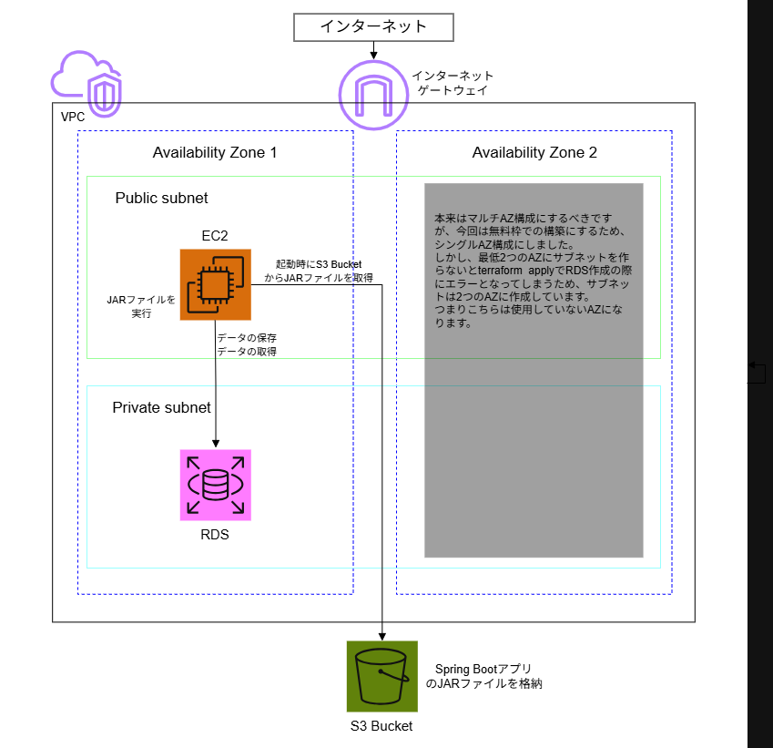

# Spring Boot APP on AWS with Terraform

EC2、VPC、RDS、S3で構築したシンプルなメモアプリケーションとなります。
Terraform を使うことで、AWS リソースをコードとして管理し、同じ構成をいつでも再現できるようにしています。
Spring Bootアプリのjarファイルは自動構築時にS3 バケットに格納され、EC2の起動時にS3 バケットから取得・実行まで自動で行われるようにしているため、terraform applyが完了した時点でアプリが動く状態になります。

---

## 🚀 概要

- EC2（Amazon Linux 2023）で Spring Boot を常時稼働
- RDS は Private Subnet に配置し、EC2 からのみアクセス可能
- S3 に JAR を配置し、EC2 起動時に自動ダウンロード
- VPC は 2AZ 構成（Public / Private Subnet）※使用しているAZは1つのみ
- Terraform による完全 IaC 化

---

## 🏗 構成図



---

## 🔧 技術スタック

- AWS
  - EC2 (Amazon Linux 2023)
  - RDS (MySQL)
  - S3
  - VPC / Subnet / IGW / Route Table
  - IAM（EC2 → S3 アクセス用）
- Terraform
- Spring Boot

---

## 📁 ディレクトリ構成
```
.
├── aws-sample/                          Spring Bootアプリのソースコードを格納しています。（配下の階層については割愛します）
├── terraform/
│      ├── main.tf
│      ├── variables.tf
│      ├── outputs.tf
│      ├── terraform.tfvars             DBのパスワードなどはこのファイルから渡しています。（値は置き換えてコミット）
│      ├── build/
│      │  └── libs/
│      │       └── app.jar             こちらにjarファイルを配置します。（githubへのコミットはなし）
│      └── modules/
│          ├── vpc/
│          │   ├── main.tf
│          │   ├── variables.tf
│          │   └── outputs.tf
│          ├── ec2/
│          │   ├── main.tf
│          │   ├── variables.tf
│          │   ├── outputs.tf
│          │   └── user-data.sh
│          ├── rds/
│          │   ├── main.tf
│          │   ├── variables.tf
│          │   └── outputs.tf
│          ├── security/
│          │  ├── main.tf
│          │  ├── variables.tf
│          │  └── outputs.tf
│          └── S3/
│              ├── main.tf
│              ├── variables.tf
│              └── outputs.tf
├── .gitignore
├── architecture.png                    構成図
└── README.md
```

---

## 📡 詳細

### 💻 アプリ仕様
このアプリケーションは、メモの保存と全件取得による参照を行うシンプルなメモAPIとなります。  
コードは aws-sample/ 配下のソースファイルに全て配置しております。

メモのデータ構造は以下になります。データストアとしてはRDSを使用し、テーブルは JPA（Hibernate）が Entity を元に自動生成します。

| カラム名     | 型                     | 制約 / 説明 |
|--------------|------------------------|-------------|
| id           | BIGINT AUTO_INCREMENT | 主キー（IDENTITY） |
| title        | VARCHAR(255)          | メモのタイトル |
| content      | VARCHAR(1000)         | メモ内容（最大1000文字） |
| created_at   | DATETIME              | 作成日時（INSERT 時に自動セット） |

Entityクラスは以下となります。
```
/aws-sample/src/main/java/com/example/demo/domain/Memo.java
```

動作方法は、以下になります。

・メモの保存  
→保存に関してはPOSTメソッドにてJSON形式でデータを送る必要があるのですが、本アプリではフォームを設置した画面等は作成していないので、curlコマンドにて保存を行いました。  
例えば、以下のようにcurlコマンドにて保存を行います。
```
curl -X POST http://<EC2-Public-IP>:8080/api/memos \
  -H "Content-Type: application/json" \
  -d '{"title":"test","content":"hello"}'
```
`<EC2-Public-IP>`の部分を、EC2のパブリックIPアドレスに置き換えます。

保存成功時、以下のようにレスポンスが返ってきます。
```
{"content":"hello","createdAt":"2026-04-19T05:22:29.056672546","id":1,"title":"test"}
```

・メモの参照  
→参照に関してはGETメソッドにて全件取得を行うのでブラウザからでも実行可能です。  
ブラウザに以下のようにURLを入力します。
```
http://<EC2-Public-IP>:8080/api/memos
```
`<EC2-Public-IP>`の部分を、EC2のパブリックIPアドレスに置き換えます。  

取得成功時、ブラウザの画面に以下のように表示されます。(データが2件存在している場合）
```
[{"content":"hello","createdAt":"2026-04-19T05:22:29. 056673", "id":1,"title":"test"}, {"content":"hello2","createdAt":"2026-04-19T05:23:00. 770593","id":2,"title":"test2"}]
```

データの保存、取得処理のコードは以下に記載しています。
```
/aws-sample/src/main/java/com/example/demo/controller/MemoController.java
```

### ☁ AWS構成
AWSの構成の詳細をモジュールごとに記載します。  
構成を定義しているTerraformのコードは terraform/ 配下に全て配置しています。  
尚、TerraFormのファイル構成はモジュールごとに切り分ける構成にしていますが、モジュールの概念については以下の記事が非常に分かりやすかったので参考にしました。
https://dev.classmethod.jp/articles/terraform_speaker_report_jawsug_tokyo/

#### 🖧 VPC
本アプリケーション専用のネットワークを作成し、その中に EC2（パブリックサブネット） と RDS（プライベートサブネット） を配置しています。  
本来であれば、複数のAZにまたがるパブリックサブネットとプライベートサブネットを作成してEC2にはオートスケーリング設定、RDSにはマルチAZ設定を施すのが定石だと思いますが、今回は無料枠に収まる最小構成ということで、シングルAZ構成で進めました。  
しかし、terraformによる自動構築時にサブネットが最低2つ以上のAZに配置されていないとRDS作成でエラーになってしまうということを後で知り、結局サブネットは2AZに作成しています。（1つのサブネットは未使用状態）  

#### 🧱 EC2
amazon_linuxの最新のAMIを取得し、東京リージョンで無料枠対象となっているインスタンスタイプ"t3.micro"にてインスタンスを作成するようにしています。  
Spring BootのJARファイルのEC2へのアップロードとアプリの起動まで全てTerraformによって自動で行うため、構築時にS3バケットを作成してJARファイルを格納し、EC2がS3からそのJARファイルを取得して起動するようにしています。  
そのため、EC2にはS3に対する"s3:GetObject"と"s3:ListBucket"アクション権限を付与したIAMポリシーを持つiAMロールを割り当てています。  

アプリのセットアップの自動化にはuser-dataを使用しています。  
user-data は EC2 が起動したタイミングで一度だけ実行され、以下の処理を行います。

- S3 から jar ファイルをダウンロード
- application-prod.properties（設定ファイル） の生成
- systemd の設定
- Spring Boot アプリの自動起動

これにより、EC2が自動的にアプリケーションを起動できる構成になっています。  
user-dataの内容を記載したファイルは、EC2モジュール配下にのみある以下のファイルです。
```
terraform/modules/ec2/user-data.sh
```

#### 📄 RDS
エンジンは"mysql"、インスタンスクラスは無料枠対象である"db.t3.micro"を使用し、シングルAZ構成の設定を明示的に記載しています。（何も書かなければデフォルトはシングルAZになるとのこと）  
ユーザーネームとパスワードはルートディレクトリの terraform.tfvars にて管理し、そちらから渡す構成にしています。  
※シークレット情報は AWS Secrets Manager によって別管理するのがベストプラクティスだと思いますが、挑戦はまた改めて。  

#### 🧰 S3
JARファイルを格納するためのバケットの作成・JARファイルの格納まで行うようにしています。  
JARファイルはあらかじめSpring Bootアプリをビルドして作成し、以下ディレクトリに配置しておきます。
```
terraform/build/libs
```

#### 🔐 Security
EC2とRDSのセキュリティグループを定義しています。

EC2のセキュリティグループの概要は以下になります。
- アプリ用ポート（ポート番号：8080）へのインバウンド通信は全て（0.0.0.0/0）から許可
- SSH（ポート番号：22）へのインバウンド通信は自分のPCのIPアドレスからの通信のみ許可
- アウトバウンド通信は全て（0.0.0.0/0）に対して許可
※SSH（ポート番号：22）からのインバウンド通信は全て不可にして、SSM Session Managerによる接続で代替するのがベストプラクティスだと思いますが、挑戦はまた改めて。

RDSのセキュリティグループの概要は以下になります。
- インバウンド通信は、パブリックサブネット上の EC2（EC2のセキュリティグループ）からの3306番ポートのみ許可
- アウトバウンド通信は全て（0.0.0.0/0）に対して許可

### 📝 構築手順
Terraformによって実際に本アプリの構成を自動構築する手順を記載します。  
terraform/ 直下のディレクトリで以下コマンドを実行します。

#### 1. 初期化
Terraform のプラグインやモジュールをダウンロードします。
```
terraform init
```

#### 2. プラン確認
どのリソースが作成・変更・削除されるかを確認します。
```
terraform plan
```

#### 3. デプロイ（作成）
構築を実行します。
```
terraform apply
```
→完了後、EC2のパブリックIPアドレスが表示されますので、そちらを用いて↑に記載している動作方法に沿って本アプリを動かすことが可能となります。

#### 4. 削除
作成したリソースをすべて削除します。

```
terraform destroy
```

以上、今回のハンズオンでした。  
⚠ 本アプリの構成は全て無料枠対象になるように工夫して作成しましたが、RDS のバックアップストレージや部分的な利用時間の切り上げ（partial hour）など、無料枠に含まれない項目があるため、月に数百円程度の料金は発生しますのでご注意ください。  
　動作確認が終われば放置せずに"terraform destroy"を行っておけば最小限に抑えられます。
